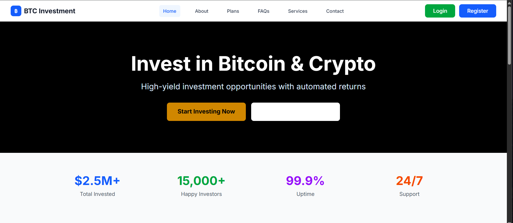

# BTC Crypto Investment Platform

A modern, secure, and scalable High-Yield Investment Program (HYIP) platform built with native PHP 8.5. This platform provides a complete investment management system with user authentication, real-time investment tracking, automated profit distribution, and comprehensive admin panel.


## � Screenshot



## �🚀 Features

### Core Features

- **User Management**: Complete user registration, authentication, and profile management
- **Investment System**: Flexible investment plans with customizable interest rates
- **Profit Distribution**: Automated daily/monthly profit calculations and payouts
- **Referral System**: Multi-level referral program with configurable commissions
- **Admin Dashboard**: Comprehensive admin panel for platform management
- **Transaction History**: Detailed transaction logs for all financial activities
- **Security**: Advanced security measures including CSRF protection, rate limiting, and encryption

### Technical Features

- **Native PHP 8.5**: Built with modern PHP features and best practices
- **MVC Architecture**: Clean separation of concerns with Model-View-Controller pattern
- **PDO Database**: Secure database abstraction with prepared statements
- **JWT Authentication**: Token-based authentication for API and session management
- **Redis Caching**: High-performance caching for improved response times
- **Responsive Design**: Mobile-first design with Tailwind CSS
- **RESTful API**: Complete API for mobile apps and third-party integrations
- **Real-time Updates**: WebSocket support for real-time notifications
- **Multi-language**: Internationalization support for global markets

### Security Features

- **Argon2id Password Hashing**: Industry-standard password security
- **CSRF Protection**: Cross-site request forgery prevention
- **Rate Limiting**: DDoS protection and abuse prevention
- **Input Validation**: Comprehensive input sanitization and validation
- **SQL Injection Prevention**: Parameterized queries and prepared statements
- **XSS Protection**: Output escaping and content security policies
- **Session Security**: Secure session management with regeneration
- **File Upload Security**: Safe file handling with type validation

## 📋 Requirements

- **PHP**: 8.1 or higher
- **Database**: MySQL 5.7+ / MariaDB 10.0+ / PostgreSQL 9.4+ / SQLite 3.8.8+
- **Web Server**: Apache 2.4+ / Nginx 1.10+ / IIS 7+
- **Extensions**:
  - PDO (with appropriate database driver)
  - JSON
  - MBString
  - OpenSSL
  - Session
  - cURL
  - GD
  - Redis (optional, for caching)
- **Composer**: For dependency management
- **Node.js**: 14+ (for frontend assets, optional)

## 🛠 Installation

### 1. Clone the Repository

```bash
git clone https://github.com/your-username/btc-crypto-investment.git
cd btc-crypto-investment
```

### 2. Install Dependencies

```bash
composer install
```

### 3. Environment Configuration

Copy the environment file and configure your settings:

```bash
cp .env.example .env
```

Edit `.env` with your configuration:

```env
# Application
APP_NAME="BTC Investment"
APP_ENV=local
APP_DEBUG=true
APP_URL=http://localhost

# Database
DB_CONNECTION=mysql
DB_HOST=127.0.0.1
DB_PORT=3306
DB_DATABASE=btc_investment
DB_USERNAME=your_username
DB_PASSWORD=your_password

# JWT Secret (generate a secure random key)
JWT_SECRET=your-very-secure-jwt-secret-key-here

# Redis (optional)
REDIS_HOST=127.0.0.1
REDIS_PORT=6379
```

### 4. Database Setup

Create the database and run migrations:

```bash
# Create database
mysql -u root -p
CREATE DATABASE btc_investment;
EXIT;

# Run migrations (if using custom migration system)
php cli/migrate.php
```

### 5. Generate Application Key

```bash
php cli/generate-key.php
```

### 6. Set Permissions

```bash
# Set proper permissions for storage and cache directories
chmod -R 755 storage/
chmod -R 755 public/uploads/
```

### 7. Web Server Configuration

#### Apache (.htaccess already included)

```apache
<VirtualHost *:80>
    ServerName your-domain.com
    DocumentRoot /path/to/btc-crypto-investment/public

    <Directory /path/to/btc-crypto-investment/public>
        AllowOverride All
        Require all granted
    </Directory>

    ErrorLog ${APACHE_LOG_DIR}/btc-investment-error.log
    CustomLog ${APACHE_LOG_DIR}/btc-investment-access.log combined
</VirtualHost>
```

#### Nginx

```nginx
server {
    listen 80;
    server_name your-domain.com;
    root /path/to/btc-crypto-investment/public;
    index index.php;

    location / {
        try_files $uri $uri/ /index.php?$query_string;
    }

    location ~ \.php$ {
        include fastcgi_params;
        fastcgi_pass unix:/var/run/php/php8.1-fpm.sock;
        fastcgi_param SCRIPT_FILENAME $document_root$fastcgi_script_name;
    }

    location ~* \.(js|css|png|jpg|jpeg|gif|ico|svg)$ {
        expires 1y;
        add_header Cache-Control "public, immutable";
    }
}
```

### 8. Create Admin User

```bash
php cli/create-admin.php
```

## 🚀 Usage

### Starting the Application

#### Development Server

```bash
composer run serve
# or
php -S localhost:8000 -t public
```

#### Production Deployment

```bash
# Using PM2 (recommended)
pm2 start ecosystem.config.js

# Or using systemd
sudo systemctl start btc-investment
```

### Basic Usage

1. **User Registration**: Users can register with email and password
2. **Investment**: Users can invest in available plans
3. **Profit Tracking**: Automatic profit distribution based on plans
4. **Withdrawals**: Users can withdraw profits with fees
5. **Referrals**: Earn commissions from referred users

### Admin Panel

Access the admin panel at `/admin` with admin credentials:

- **User Management**: View, edit, suspend user accounts
- **Investment Management**: Monitor and manage investments
- **Transaction History**: View all financial transactions
- **Settings**: Configure platform settings and rates
- **Reports**: Generate financial and user reports

## 📁 Project Structure

```
btc-crypto-investment/
├── app/                          # Application code
│   ├── Controllers/             # Controller classes
│   ├── Models/                  # Model classes
│   ├── Core/                    # Core framework classes
│   ├── Middleware/              # Middleware classes
│   ├── Validation/              # Validation classes
│   └── routes.php               # Route definitions
├── config/                      # Configuration files
│   ├── app.php                  # Application config
│   ├── database.php             # Database config
│   ├── constants.php            # Application constants
│   └── env.php                  # Environment loader
├── database/                    # Database files
│   ├── schema.sql               # Database schema
│   └── migrations/              # Migration files
├── public/                      # Public web root
│   ├── index.php                # Application entry point
│   ├── assets/                  # Static assets
│   └── uploads/                 # User uploads
├── resources/                   # Resource files
│   ├── views/                   # Template files
│   ├── lang/                    # Language files
│   └── assets/                  # Source assets
├── storage/                     # Storage directory
│   ├── cache/                   # Cache files
│   ├── logs/                    # Log files
│   ├── sessions/                # Session files
│   └── uploads/                 # File uploads
├── tests/                       # Test files
├── cli/                         # Command line tools
├── vendor/                      # Composer dependencies
├── .env.example                 # Environment template
├── .gitignore                   # Git ignore rules
├── composer.json                # Composer configuration
├── README.md                    # This file
└── 00-FULL-DOCUMENT.md          # Full documentation
```

## 🔧 Configuration

### Environment Variables

| Variable | Description | Default |
|----------|-------------|---------|
| `APP_NAME` | Application name | BTC Investment |
| `APP_ENV` | Environment (local/production) | production |
| `APP_DEBUG` | Debug mode | false |
| `APP_URL` | Application URL | <http://localhost> |
| `DB_CONNECTION` | Database driver | mysql |
| `DB_HOST` | Database host | 127.0.0.1 |
| `DB_PORT` | Database port | 3306 |
| `DB_DATABASE` | Database name | btc_investment |
| `DB_USERNAME` | Database username | root |
| `DB_PASSWORD` | Database password | (empty) |
| `JWT_SECRET` | JWT secret key | (required) |
| `REDIS_HOST` | Redis host | 127.0.0.1 |
| `REDIS_PORT` | Redis port | 6379 |

### Investment Settings

Configure investment plans and rates in the admin panel or directly in the database:

```sql
INSERT INTO investment_plans (name, min_amount, max_amount, interest_rate, duration_days, status) VALUES
('Starter Plan', 10, 1000, 5.0, 30, 'active'),
('Premium Plan', 1000, 10000, 8.0, 60, 'active'),
('VIP Plan', 10000, 100000, 12.0, 90, 'active');
```

## 🧪 Testing

Run the test suite:

```bash
# Run all tests
composer test

# Run specific test
./vendor/bin/phpunit tests/Unit/ExampleTest.php

# Run with coverage
./vendor/bin/phpunit --coverage-html coverage/
```

## 📊 API Documentation

### Authentication

```bash
# Login
POST /api/v1/auth/login
Content-Type: application/json

{
  "email": "user@example.com",
  "password": "password"
}
```

### Investment Operations

```bash
# Get user balance
GET /api/v1/user/balance
Authorization: Bearer {token}

# Make investment
POST /api/v1/user/invest
Authorization: Bearer {token}
Content-Type: application/json

{
  "plan_id": 1,
  "amount": 100
}
```

## 🔒 Security

### Best Practices

1. **Environment Variables**: Never commit `.env` files to version control
2. **File Permissions**: Set restrictive permissions on sensitive files
3. **HTTPS**: Always use HTTPS in production
4. **Regular Updates**: Keep PHP and dependencies updated
5. **Monitoring**: Implement logging and monitoring
6. **Backup**: Regular database and file backups

### Security Features

- **Password Hashing**: Argon2id algorithm
- **CSRF Protection**: Tokens for all forms
- **Rate Limiting**: Prevents abuse and DDoS
- **Input Validation**: Comprehensive validation
- **SQL Injection Prevention**: Prepared statements
- **XSS Protection**: Output escaping

## 🚀 Deployment

### Production Checklist

- [ ] Set `APP_ENV=production`
- [ ] Set `APP_DEBUG=false`
- [ ] Configure proper database credentials
- [ ] Set strong `JWT_SECRET`
- [ ] Configure HTTPS certificates
- [ ] Set up proper file permissions
- [ ] Configure backup systems
- [ ] Set up monitoring and logging
- [ ] Configure firewall rules
- [ ] Set up SSL/TLS certificates

### Docker Deployment

```dockerfile
FROM php:8.1-fpm-alpine

# Install dependencies
RUN apk add --no-cache \
    nginx \
    mysql-client \
    redis

# Copy application
COPY . /var/www/html

# Install PHP extensions
RUN docker-php-ext-install pdo pdo_mysql

# Configure nginx
COPY docker/nginx.conf /etc/nginx/nginx.conf

EXPOSE 80

CMD ["sh", "docker/start.sh"]
```

## 🤝 Contributing

1. Fork the repository
2. Create a feature branch (`git checkout -b feature/amazing-feature`)
3. Commit your changes (`git commit -m 'Add amazing feature'`)
4. Push to the branch (`git push origin feature/amazing-feature`)
5. Open a Pull Request

### Development Guidelines

- Follow PSR-12 coding standards
- Write tests for new features
- Update documentation
- Use meaningful commit messages
- Keep PRs focused and small

## 📝 License

This project is licensed under the MIT License - see the [LICENSE](LICENSE) file for details.

## 🆘 Support

### Documentation

- [Full Documentation](00-FULL-DOCUMENT.md)
- [API Documentation](docs/api.md)
- [Deployment Guide](docs/deployment.md)

### Community

- **Issues**: [GitHub Issues](https://github.com/your-username/btc-crypto-investment/issues)
- **Discussions**: [GitHub Discussions](https://github.com/your-username/btc-crypto-investment/discussions)
- **Discord**: [Join our Discord](https://discord.gg/btcinvestment)

### Professional Support

For professional support, consulting, or custom development:

- Email: <support@btc-investment.com>
- Website: <https://btc-investment.com/support>

## 🙏 Acknowledgments

- [PHP](https://php.net) - The programming language
- [Composer](https://getcomposer.org) - Dependency management
- [Tailwind CSS](https://tailwindcss.com) - Utility-first CSS framework
- [Laravel](https://laravel.com) - Inspiration for structure and patterns
- [Open Source Community](https://opensource.org) - For amazing tools and libraries

## 📈 Roadmap

### Version 1.1.0

- [ ] Multi-currency support
- [ ] Advanced reporting system
- [ ] Email notifications
- [ ] Two-factor authentication

### Version 1.2.0

- [ ] Mobile app API
- [ ] Payment gateway integrations
- [ ] Advanced analytics
- [ ] White-label solution

### Version 2.0.0

- [ ] Microservices architecture
- [ ] Real-time trading features
- [ ] AI-powered investment recommendations
- [ ] Blockchain integration

---

**Made with ❤️ for the crypto investment community**

*BTC Crypto Investment Platform - Secure, Scalable, and Profitable*
